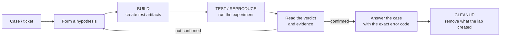
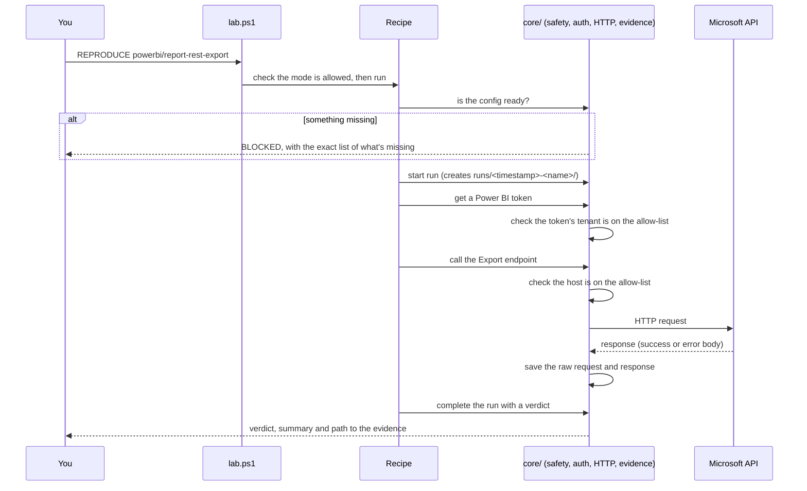

# What is Dextors Lab, and how does it work?

**Audience:** support engineers who investigate Microsoft 365, Power Platform and Power BI
backup and restore cases and want to understand what the lab is for before using it.

**Next:** once this makes sense, go to [how-to-use-dextors-lab.md](how-to-use-dextors-lab.md)
for step-by-step instructions. The full reference is the [Operator Guide](USER-GUIDE.md).

---

## 1. In one sentence

Dextors Lab is a set of PowerShell scripts that **reproduces Microsoft-side backup and restore
behaviour in your own test tenant**, so you can prove what Microsoft's APIs do (and which
error code they return) instead of guessing from a customer's job log.

## 2. The problem it solves

A typical case looks like this:

> *"Our backup says it succeeded, but three Power BI reports are missing."*
> *"Restoring our Dynamics contacts fails with a lookup error."*
> *"The archive mailbox backup looks empty."*

To answer it well you have to know whether the behaviour comes from:

- **Microsoft**, as documented product behaviour or an API limitation,
- **the backup product**, as a bug or a gap in what it covers, or
- **the customer's configuration**, such as a tenant setting, a model setting or a missing
  permission.

You can't experiment in the customer's tenant, and a job log often can't tell these apart. For
example, an item the API never returns leaves no error in the log at all. The lab gives you a
safe place to rebuild the customer's condition, call the same Microsoft APIs, and keep the exact
responses as evidence.

## 3. What it is and what it isn't

| It is | It is not |
|---|---|
| A PowerShell 7 toolkit that calls Microsoft REST APIs directly | A product, a service or a web app |
| Pointed only at **your own** test tenant | Something you ever point at a customer or production tenant |
| A library of ready-made experiments called **recipes** | A general-purpose admin tool |
| A way to collect evidence you can quote in a case | A place for customer data |
| Microsoft-side validation only | Backup-platform automation, which is out of scope |
| Run directly from PowerShell; Claude Code is an optional interface | Dependent on Claude Code or any AI service |

There's nothing to install beyond PowerShell 7: no modules, no build step, no database and no
background service.

## 4. The investigation loop

Every use of the lab follows the same loop:



1. **Hypothesis.** For example: "The report export fails because the semantic model has
   incremental refresh."
2. **BUILD** a test artifact with that property in your test tenant.
3. **TEST** or **REPRODUCE**: run the experiment against it.
4. **Read the result.** You get a verdict (PASS, FAIL and so on) and a folder with every request
   and every raw response, including the Microsoft error code.
5. **CLEANUP.** The lab removes only what it created itself.

## 5. The building blocks

### 5.1 The dispatcher: `lab.ps1`

This is the one command you run. You tell it a **mode** and a **recipe**:

```powershell
.\lab.ps1 REPRODUCE powerbi/report-rest-export -Target powerbi-main
#          ^^^^^^^^^ ^^^^^^^^^^^^^^^^^^^^^^^^^^ ^^^^^^^^^^^^^^^^^^^^
#          mode      recipe (product/name)       which test environment
```

The dispatcher finds the recipe, checks that it supports the mode you asked for, and runs it.
`.\lab.ps1 LIST` shows every recipe available.

### 5.2 Modes: what you intend to do

| Mode | Plain meaning | Changes anything? |
|---|---|---|
| `INSPECT` | Look around and collect evidence | No, read-only |
| `BUILD` | Create test resources such as a site, a table, a dataflow or seed data | Yes, creates things |
| `TEST` | Run a defined experiment | Depends on the recipe |
| `REPRODUCE` | Try to trigger a known failure | Depends on the recipe |
| `CLEANUP` | Remove resources the lab created | Yes, deletes lab-owned things only |

Each recipe declares the modes it supports, and the dispatcher refuses any other mode.

### 5.3 Recipes: one experiment per file

A recipe is a single script in `recipes/<product>/`, for example
`recipes/powerbi/report-rest-export.ps1`. Each one:

- states its purpose and **what PASS, FAIL and INCONCLUSIVE mean** in its file header,
- lists what it needs (such as a workspace ID or a site URL) and stops cleanly if something is
  missing,
- makes its API calls and records everything,
- ends with a verdict.

The products covered today:

| Product | Example recipes | Typical case it helps with |
|---|---|---|
| **Power BI / Fabric** | `report-rest-export`, `backup-coverage-matrix`, `dataflow-gen2-visibility` | "Reports or dataflows are missing from the backup" |
| **Power Platform / Dataverse** | `seed-cycle-dataset`, `verify-dataset-state`, `reproduce-field-security-restore`, `reproduce-flow-solution-restore` | "Restore fails on lookups, secured columns or flows in solutions" |
| **Power Pages** | `inspect-powerpages-site`, `build-powerpages-edm-testset` | "Power Pages content isn't backed up or restored" |
| **SharePoint** | `build-test-site`, `prepare-modern-page`, `inspect-site-rest` | "Site pages or list content don't come back correctly" |
| **Exchange** | `archive-graph-delta`, `archive-incremental-sync` | "The In-Place Archive backup is empty or incomplete" |
| **Lab itself** (`lab/`) | `init`, `status`, `setup-app-registration`, `cleanup-tracked-resources` | Setup, health checks and cleanup |

The full list with arguments is in [USER-GUIDE.md §4](USER-GUIDE.md#4-recipe-reference).

### 5.4 The framework: `core/` and `tools/`

Recipes don't talk to Microsoft directly. They use a small shared framework, and that
framework is what keeps runs consistent and safe:

| Piece | What it does for you |
|---|---|
| **Config** | Reads your tenant, identities and targets from `lab.config.json` |
| **Safety** | Refuses anything outside your test tenant or anything that looks like production |
| **Auth** | Gets the right token for each Microsoft API (Graph, SharePoint, Dataverse, Power BI) |
| **HTTP** | The **only** path to the network. It checks the host, supports dry-run and saves every request and response |
| **Evidence / Run** | Creates the run folder, writes the plan, the result and the verdict |
| **Resources** | Records everything the lab creates in a ledger, so cleanup knows exactly what's lab-owned |
| **tools/** | Product helpers such as SharePoint REST calls, Dataverse calls, Power BI seed data and flow helpers |

### 5.5 Code and state are kept apart

| | What | Where |
|---|---|---|
| **LabRoot** | The code (this repository) | Wherever you cloned it |
| **LabHome** | Your configuration, credentials, certificates, evidence and generated files | `$env:LAB_HOME`, else the checkout if it has a `config/lab.config.json`, else `~/.dextors-lab` |

This means you can update the code without losing your setup, and your tenant details and
evidence never end up in git.

## 6. What happens when you run a recipe



## 7. The safety boundary

The lab is built so that it **can't** reach a customer or production tenant, even by mistake.
These checks are enforced in code, and every one of them stops the run:

| Check | What it stops |
|---|---|
| **Tenant allow-list** (`allowedTenantIds`) | Signing in to any tenant you didn't nominate. If the list is empty, the lab won't sign in at all |
| **Token check** | A misconfigured app landing in another tenant. The tenant ID inside the issued token is checked, not just the config |
| **Host allow-list** (`allowedApiHosts`) | Calling any web address that isn't listed |
| **Name deny-list** (`denyNamePatterns`) | Targeting anything named like `*prod*`, `*customer*`, `*live*` and similar |
| **Delete gate** | Deleting anything that isn't in the lab's own ledger, or deleting without an explicit `-Force` |

If one of these stops you, **the boundary is working as intended**. Don't widen the policy to get
around it. Changing `lab.policy.json` should always be a deliberate, manual decision.

## 8. Authentication in plain terms

Each Microsoft API needs its own token, and each product uses the sign-in method that avoids a
known Microsoft restriction:

| Product | How the lab signs in | Why |
|---|---|---|
| Graph (mail, sites, users) | As an app, with a client secret | Unattended, no sign-in prompt |
| SharePoint REST (`_api`) | As an app, with a **certificate** | SharePoint rejects secret-based app tokens (`401 Unsupported app only token`) |
| Dataverse / Power Platform | As **you**, with a device code | No extra application user needed in each environment |
| Power BI / Fabric | As **you**, with a device code | Avoids service-principal restrictions that would muddy export tests |

"Device code" means the first run prints a URL and a short code. You open the URL, enter the code
and sign in. After that the lab caches the sign-in, so you aren't asked again every run.

## 9. Verdicts, and the one that surprises people

| Verdict | Meaning |
|---|---|
| `PASS` | The recipe's success condition was met |
| `FAIL` | The success condition wasn't met |
| `INCONCLUSIVE` | The lab couldn't get the data it needed to decide, usually because of auth or permissions |
| `BLOCKED` | Something is missing from setup. The output lists exactly what |
| `DONE` | An informational or cleanup recipe finished |

> **For `REPRODUCE` recipes, `PASS` means "the reported problem was reproduced".**
> For example, a PASS from `powerbi/report-rest-export` means the export **failed** and the lab
> captured the exact error code. That's the opposite of the usual test convention, so always read
> the recipe's file header before you interpret a result.

## 10. Evidence: what you get out of it

Every run creates its own folder:

```
runs/20260929-101500-pbi-report-rest-export/
    request.md       what you asked for
    plan.md          the steps the recipe intended to take
    result.md        verdict, summary and key findings   <- start here
    metadata.json    run ID, tenant, timings, verdict
    resources.json   anything this run created
    requests/        every outbound call (the Authorization header is removed)
    responses/       every raw response, including errors <- the exact Microsoft error code is here
    logs/run.log     the full execution log
```

Error bodies are saved exactly as Microsoft returned them, because the precise error code is
usually what answers the case. Run folders can contain your test tenant's identifiers, so keep
them local and share only the relevant excerpt.

## 11. Glossary

| Term | Meaning |
|---|---|
| **Recipe** | One experiment script, named `product/name` |
| **Mode** | What you intend to do: BUILD, TEST, REPRODUCE, INSPECT or CLEANUP |
| **Target** | A named test environment in your config, such as `powerbi-main` (a workspace) or `dataverse-main` (an environment URL) |
| **Identity** | A named app registration plus how to sign in with it, such as `msg-app` or `kslab-pbi` |
| **Reserved identity** | An alternative app-only identity (`*-appauth`) that's only used when you name it explicitly |
| **LabHome** | Your local state folder: config, secrets, certificates, runs |
| **Run** | One execution of a recipe, with its own evidence folder |
| **Ledger** | `runs/_ledger.jsonl`, the list of everything the lab created. Cleanup only uses this |
| **Dry run** (`-DryRun`) | Reads happen, writes are skipped and logged, so you can preview safely |
| **Verdict** | The outcome of a run: PASS, FAIL, INCONCLUSIVE, BLOCKED or DONE |

## 12. Where to go next

- **Start using it:** [how-to-use-dextors-lab.md](how-to-use-dextors-lab.md)
- **Full reference** (every recipe, config key and error): [USER-GUIDE.md](USER-GUIDE.md)
- **Power BI items missing from backup** (validated findings): [powerbi-backup-coverage.md](powerbi-backup-coverage.md)
